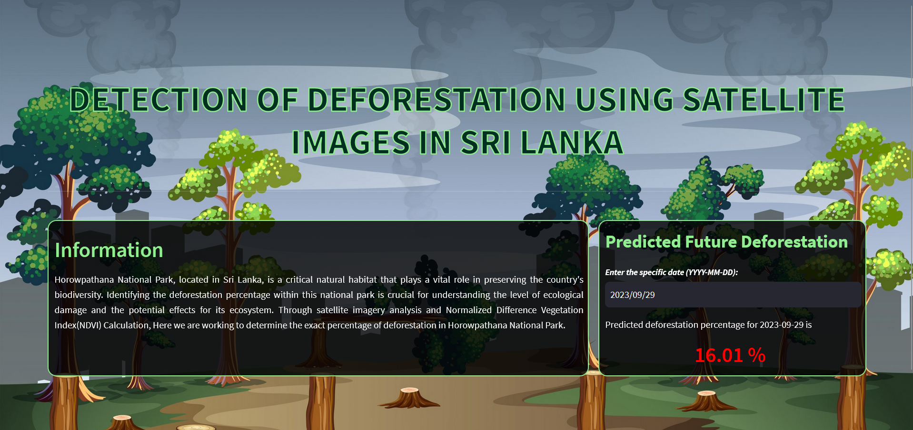

#DETECTION OF DEFORESTATION USING SATELLITE IMAGES IN SRI LANKA

This is an dashboard made to predict the percentage of deforestation in Horowpathana
National park, Sri Lanka. Model built using satellite images taken from Landset 8 satellite
from 2018 to 2023.

### Dashboard
Dashboard developed using streamlit, HTML and CSS.

Dashboard : https://deforestationpredictorwebapp-pedv77wsmxjhovppeyptq5.streamlit.app/
